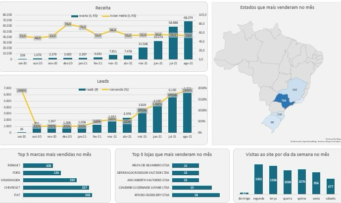

#  Acompanhamento de Vendas | SQL & Excel

 

## Sobre este Projeto
Este projeto foi desenvolvido para **fins de estudo e prática** de análise de dados. O objetivo principal foi aplicar conhecimentos técnicos para resolver um desafio real de negócio: transformar dados brutos de um banco de dados em um dashboard de "chicote" para tomada de decisão.

## Objetivo da Análise
O foco foi monitorar os principais **drivers de resultado** de uma operação comercial, permitindo o acompanhamento diário e mensal da performance de vendas.

## Indicadores de Desempenho (KPIs) Analisados
A partir das consultas desenvolvidas no **pgAdmin 4**, extraí os seguintes indicadores para o Excel:
- **Funil de Vendas**: Evolução mensal de Receita, geração de Leads, Taxa de Conversão e Ticket Médio.
- **Top 5 Marcas e Lojas**: Ranking das marcas e unidades que mais venderam no mês.
- **Visão Geográfica**: Identificação dos 5 estados com maior volume de pedidos.
- **Comportamento de Tráfego**: Análise de visitas ao site distribuídas pelos dias da semana.

##  Conhecimentos Técnicos Praticados
Neste projeto, apliquei conceitos avançados de **SQL (PostgreSQL)**, como:
- **CTEs (Common Table Expressions)**: Para organizar e estruturar consultas complexas.
- **Joins**: Para consolidar dados de tabelas de funil, produtos, lojas e clientes.
- **Funções de Data**: Uso de `date_trunc` e `extract` para análises temporais e de sazonalidade.
- **Lógica de Negócio**: Criação de métricas calculadas como Ticket Médio e Conversão.

##  Ferramentas Utilizadas
- **SQL (PostgreSQL)**: Extração e tratamento de dados.
- **Microsoft Excel**: Criação do dashboard visual e gráficos dinâmicos.

